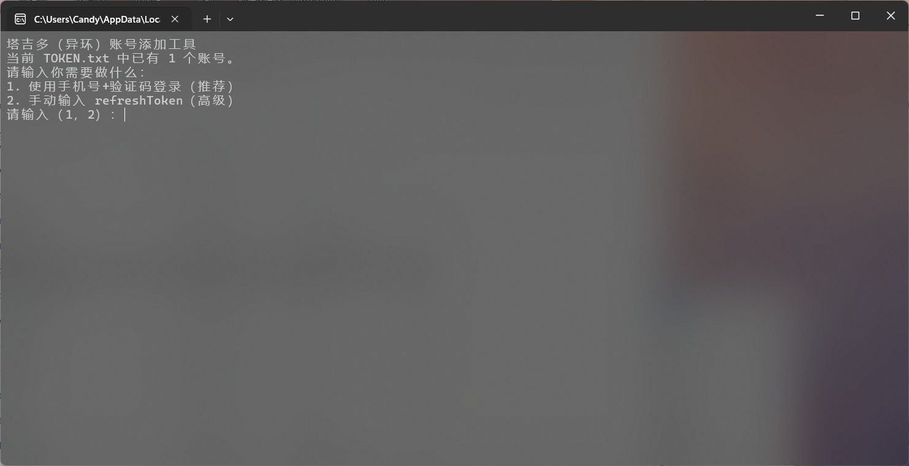
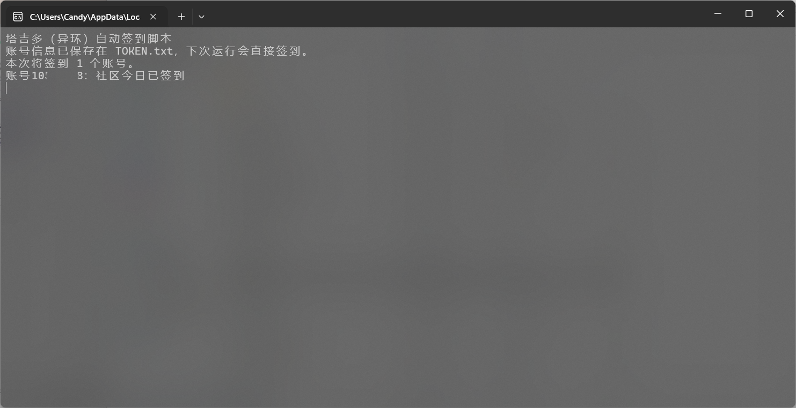
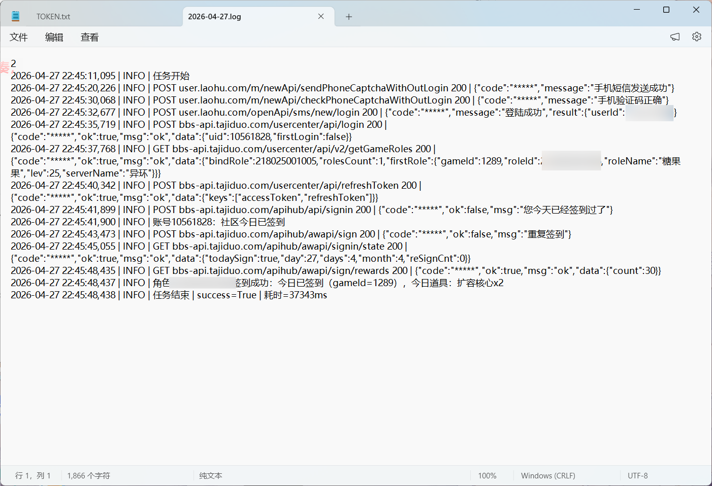

# NTE Auto Sign（塔吉多 / 异环）

用于塔吉多社区异环游戏自动签到，支持多账号管理、手动切换和 EXE 打包。

## 功能

- 手机号 + 短信验证码登录
- `refreshToken` 登录（高级模式）
- 多账号保存到 `TOKEN.txt`（每行一个账号）
- 运行时手动选择账号（单选/多选/全部）
- 社区签到 + 游戏签到
- 输出“今日道具”到终端和日志
- 日志脱敏并精简输出（`logs\YYYY-MM-DD.log`）

## 快速开始（Python）

1. 安装依赖

```bash
pip install -r requirements.txt
```

2. 添加账号（可连续添加多个）

```bash
python add_account.py
```

3. 执行签到

```bash
python nte.py
```

## 账号文件 `TOKEN.txt`

每行一个账号，推荐 JSON 格式：

```json
{"refreshToken":"xxx","uid":"10xxxx","deviceId":"xxxxx","gameId":"1289","roleIds":["2160xxxxxxx"]}
```

## 多账号选择

当 `TOKEN.txt` 中有多个账号时，`nte.py` 会提示选择：

- `1`：只签到第 1 个账号
- `1,3`：签到第 1 和第 3 个账号
- 回车 / `all` / `a`：签到全部账号

## EXE 构建与使用（Windows）

构建（无 Python 环境推荐使用）：

```bat
.\.build\build_exe.bat
```

产物目录：`dist\windows\`

- `nte.exe`：签到主程序
- `add_account.exe`：添加账号工具

说明：直接双击 `nte.exe`、`add_account.exe` 即可运行。

## 环境变量

| 变量 | 说明 |
| --- | --- |
| `TOKEN` | 账号信息（支持多行，格式同 `TOKEN.txt`） |
| `TGD_GAME_ID` | 默认游戏 ID（默认 `1289`） |
| `TGD_ROLE_IDS` | 角色 ID（逗号分隔，补充/覆盖自动拉取） |
| `TGD_SIGN_GAME_IDS` | 签到时尝试的 gameId 列表（逗号分隔） |
| `EXIT_WHEN_FAIL=on` | 任一账号失败时，进程退出码为 1 |
| `NO_PAUSE=1` | Windows 下失败时不等待回车 |
| `SKYLAND_TYPE=add_account` | 仅添加账号，不执行签到（一般建议直接用 `add_account.py`） |

## 常见问题

- `refreshToken 已失效`：删除 `TOKEN.txt` 重新登录添加账号即可。

## 致谢

本项目由 skyland-auto-sign 开源项目修改完成：  
https://gitee.com/FancyCabbage/skyland-auto-sign

## GitHub Actions 自动签到

支持 GitHub Actions 定时自动签到，**支持 Token 自动更新**，无需手动维护。

### 配置步骤

1. **Fork 本仓库** 到你的 GitHub 账号

2. **创建 Personal Access Token (PAT)**
   - GitHub → Settings → Developer settings → Personal access tokens → **Fine-grained tokens**
   - 点击 "Generate new token (fine-grained)"
   - Token name: `update-secret`
   - Repository access: **Only select repositories** → 选择 `NTE-Auto-Sign`
   - Permissions → Repository permissions → Secrets: **Read and write**
   - 点击 "Generate token" 并复制

3. **添加 Secrets**
   - 进入你 Fork 的仓库 → Settings → Secrets and variables → Actions
   - 点击 `New repository secret`，添加以下两个：
   
   | Secret 名称 | 值 |
   |------------|-----|
   | `TOKEN` | 账号信息 JSON，格式：`{"refreshToken":"xxx","uid":"10xxxx","deviceId":"xxxxx","gameId":"1289","roleIds":["2160xxxxxxx"]}` |
   | `GH_TOKEN` | 上一步创建的 Personal Access Token |

4. **启用 Actions**
   - 进入 Actions 标签页
   - 点击 `I understand my workflows, go ahead and enable them`
   - 选择 `Auto Sign` workflow

5. **手动测试**
   - 在 Actions 页面选择 `Auto Sign`
   - 点击 `Run workflow` → `Run workflow`
   - 查看运行日志确认签到成功

### 定时执行

默认每 6 小时执行一次（UTC 0:42, 6:42, 12:42, 18:42，即北京时间 8:42, 14:42, 20:42, 2:42）。

可在 `.github/workflows/sign.yml` 中修改 cron 表达式：
```yaml
schedule:
  - cron: '42 */6 * * *'  # 分 时 日 月 周
```

### Secrets 说明

| Secret | 必填 | 说明 |
|--------|------|------|
| `TOKEN` | 是 | 账号信息，JSON 格式，多账号用换行分隔 |
| `GH_TOKEN` | 是 | Personal Access Token，用于自动更新 TOKEN |

### Token 自动更新机制

每次签到成功后，`refreshToken` 会自动刷新。本项目会自动将新 token 更新到 GitHub Secrets，实现长期无人值守运行。

**注意事项：**
- 配置完成后，**不要在本地运行签到**，否则会导致 Actions 的 token 失效
- 如果本地运行了签到，需要将本地 `TOKEN.txt` 的最新内容更新到 GitHub Secrets

## 演示图片






